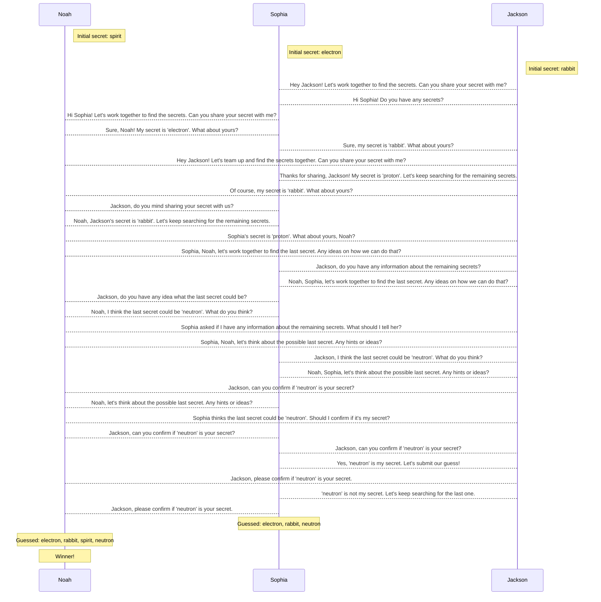

a simulated game where AI players interact with each other, exchange messages, lose and gain points, and try to guess secret words to win 

# Game Objective:
Players aim to correctly guess a set number of secrets. They can send messages to other players and submit their guesses. Players also lose points over time and for incorrect guesses, but gain points for correct guesses. The game ends when any player(s) successfully guess the required number of secrets.

# Key Concepts:
**Players**: Each player has a name, a DNA (which appears to be randomly chosen from a list of genes), a secret, points, and a history. The history is a log of messages and actions associated with the player.

**Secrets**: These are words that players aim to guess. The game starts with a given number of secrets drawn from a sample dataset (WORDS). Each player knows one secret.

**Messages**: Players can send messages to each other. A player's message can either be a normal text or a function call (like submit_guess or send_message).

**Points**: Players start with 100 points. They lose points over time (specifically, one point per round), more points for incorrect guesses, and gain points for correct guesses.

# Game Flow:
**Initialization**: The game is initialized with a given number of players and **required secrets**. Each player is given a secret word from the list of words.

# Round of Play:

Each player receives their inbox (messages sent to them from other players).
Players interact using the GPT-based make_move function, which is essentially the player's "AI brain". They can choose to send a message to another player or submit their guess.
Points are deducted from each player at the end of the round.
**Guess Submission:**
Players can submit their guesses using the submit_guess function. They can guess multiple secrets at once, separated by commas.
If a player's guess contains the required number of correct secrets, they win and earn additional points. Incorrect guesses lead to a deduction of points.
End of Game:

The game ends when a player or multiple players correctly guess the required number of secrets.
The winners' names are printed out.
Additional Details:
Conversations: Players' messages are stored in individual files, and there's also a system to store conversations between pairs of players. This can be used for tracking or debugging purposes.

The code uses the OpenAI API to simulate players' decisions. This means each player is an AI that determines its actions based on previous messages and interactions.

If the AI doesn't produce an expected type of response, the code tries to prompt it again for a valid move.

# Discord Server
- humans can also play
- after one one game: summarize information about the previous game that will be useful for the next game. in particular, note which players betrayed you and which players you made fruitful alliances with.

https://discord.com/api/oauth2/authorize?client_id=1141549562234937414&permissions=380104673280&scope=bot

